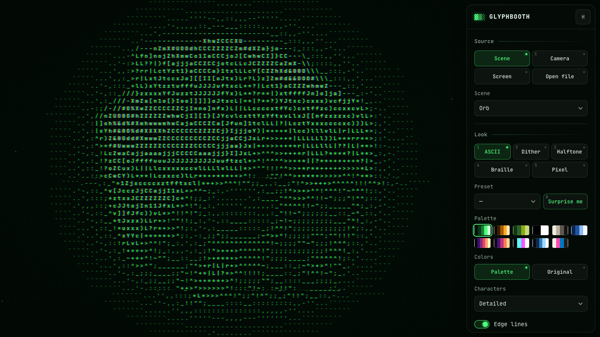
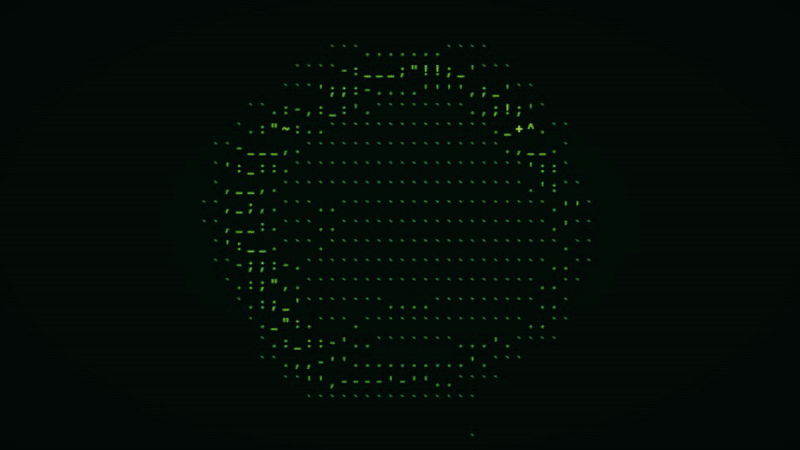
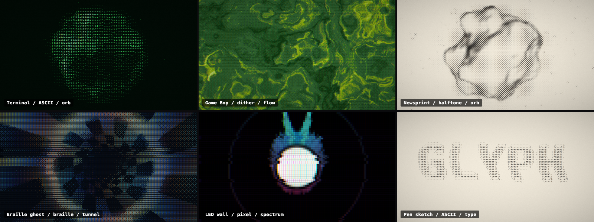

<p align="center"></p>

# Glyphbooth

> Kameranı, ekranını, videonu ve müziğini canlı ASCII, dither, halftone, braille ve piksel sanatına çevir.

[](https://github.com/mrsarac/glyphbooth/actions/workflows/ci.yml)
[](LICENSE)
[](https://mrsarac.github.io/glyphbooth/)

[English](README.md) | Türkçe

Glyphbooth bir WebGL2 uygulamasıdır. Tarayıcıda ve macOS, Windows ve Linux masaüstünde çalışır. Kameranı, ekranını, bir videoyu, bir görseli, yazdığın bir kelimeyi veya bir şarkıyı gösterirsin. Uygulama görüntüyü karakterlere, noktalara veya piksellere çevirir. Görüntü müziğin ritmiyle hareket eder.

## Dene

- **Tarayıcıda:** [mrsarac.github.io/glyphbooth](https://mrsarac.github.io/glyphbooth/). **Başla** düğmesine bas. Bir sahne ve dahili bir ritim çalar. `C` (kamera) veya `M` (mikrofon) tuşuna basana kadar izin istenmez.
- **Masaüstü uygulaması:** son sürümü [Releases](https://github.com/mrsarac/glyphbooth/releases/latest) sayfasından indir.

| Sistem | Dosya |
|---|---|
| macOS, Apple Silicon (M1 ve üstü) | `Glyphbooth-<sürüm>-mac-arm64.dmg` |
| macOS, Intel | `Glyphbooth-<sürüm>-mac-x64.dmg` |
| Windows 10 ve üstü, 64 bit | `Glyphbooth-<sürüm>-win-x64.exe` |
| Linux, 64 bit | `Glyphbooth-<sürüm>-linux-x86_64.AppImage` |

macOS uygulaması v0.1.1 sürümünden itibaren Apple tarafından imzalı ve onaylıdır (notarized). [macOS'ta ilk açılış](#macosta-ilk-açılış) bölümüne bak.

<p align="center"></p>

## Özellikler

- **Kaynaklar:** kamera, ekran, video, görsel, yazdığın metin veya dahili sahneler (küre, tünel, akış, spektrum, yazı). Dosyayı pencereye sürükleyip bırakabilirsin.
- **Beş mod:** ASCII, dither, halftone, braille ve piksel.
- **Görünüm:** 12 hazır ayar, 11 palet, 6 karakter seti. Kendi karakterlerini de yazabilirsin.
- **Kenar çizgileri:** ASCII modunda `| / - \` karakterleri görüntünün kenarlarını izler.
- **Sese tepki:** vuruş algılama yakınlaşmayı, renk ayrışmasını ve flaşı yönetir. Ses kaynağı dahili demo ritmi, mikrofon veya ses dosyasıdır.
- **Dışa aktarma:** PNG, sesli WebM video, panoya düz metin ASCII, renkli HTML ve görünümünü taşıyan bağlantı.
- **Dil:** arayüz, tarayıcı dilin Türkçe ise Türkçe açılır.

<p align="center"></p>

## Klavye kısayolları

Tüm kısayollar harf veya rakamdır. Her klavye düzeninde çalışır.

| Tuş | İş |
|---|---|
| `1` – `5` | Mod: ASCII, Dither, Halftone, Braille, Piksel |
| `G` | Sonraki hazır ayar |
| `P` | Sonraki palet |
| `R` | Şaşırt beni (rastgele görünüm) |
| `N` | Sonraki sahne |
| `C` | Kamera |
| `M` | Mikrofon |
| `D` | Demo ritmi aç veya kapat |
| `S` | PNG kaydet |
| `V` | Video kaydını başlat veya durdur |
| `T` | Metin olarak kopyala |
| `F` | Tam ekran |
| `H` | Paneli gizle veya göster |

## macOS'ta ilk açılış

v0.1.1 sürümünden itibaren `.dmg` dosyası Developer ID ile imzalıdır ve Apple tarafından onaylanmıştır (notarized). Dosyayı aç, **Glyphbooth** uygulamasını **Applications** klasörüne sürükle ve normal şekilde başlat.

**Yalnızca v0.1.0 için:** bu sürüm onaylı değildir. macOS ilk açılışı engeller. İki yoldan birini seç.

**Yol 1: Sistem Ayarları**

1. `.dmg` dosyasını aç ve **Glyphbooth** uygulamasını **Applications** klasörüne sürükle.
2. **Glyphbooth** uygulamasını bir kez aç. macOS uyarı gösterir. **Done** düğmesine bas.
3. **System Settings → Privacy & Security** bölümünü aç. **Security** başlığına kadar aşağı kaydır.
4. "Glyphbooth was blocked" satırındaki **Open Anyway** düğmesine bas. Parolanı gir.

**Yol 2: Terminal**

1. **Glyphbooth** uygulamasını **Applications** klasörüne sürükle.
2. Şu komutu çalıştır:
   ```bash
   xattr -dr com.apple.quarantine /Applications/Glyphbooth.app
   ```
3. Uygulamayı normal şekilde aç.

**Kamera, mikrofon ve ekran izni**

- Her kaynağı ilk kullandığında macOS izin ister. **Allow** düğmesine bas.
- **Don't Allow** dersen **System Settings → Privacy & Security** bölümünü aç. **Camera**, **Microphone** veya **Screen Recording** seç ve **Glyphbooth** anahtarını aç. Sonra uygulamayı yeniden başlat.
- macOS'ta ekran yakalama sistem sesini almaz. Mikrofonu, bir dosyayı veya demo ritmi kullan.

## Windows'ta ilk açılış

Windows SmartScreen bilinmeyen yayıncı uyarısı verebilir.

1. **More info** bağlantısına tıkla.
2. **Run anyway** düğmesine bas.

Windows'ta ekran yakalama sistem sesini de alır.

## Linux'ta ilk açılış

1. Dosyayı çalıştırılabilir yap: `chmod +x Glyphbooth-*-linux-x86_64.AppImage`
2. Çalıştır: `./Glyphbooth-*-linux-x86_64.AppImage`

Uygulama açılmazsa FUSE 2 kur: Ubuntu 24.04'te `sudo apt install libfuse2t64`, Ubuntu 22.04'te `sudo apt install libfuse2`.

Ubuntu 24.04, Chromium sandbox'ını AppArmor ile kısıtlar. Uygulama SUID sandbox mesajıyla duruyorsa `--no-sandbox` ile çalıştır:

```bash
./Glyphbooth-*-linux-x86_64.AppImage --no-sandbox
```

## Kayıt notları

- Safari MP4 kaydeder. Diğer tarayıcılar WebM kaydeder.
- Mikrofon sesi kayda dahildir.

## Gizlilik

Her şey bilgisayarında çalışır. Hiçbir şey yüklenmez: kamera görüntüsü, mikrofon sesi ve dosyaların dahil. Uygulamada analitik ve hesap yoktur. Ayarların tarayıcının yerel depolamasında kalır. Paylaşılan bağlantı yalnızca görünüm ayarlarını taşır, medya taşımaz.

## Kaynaktan derle

Node.js 22 veya üstü ve WebGL2 destekleyen bir tarayıcı gerekir.

```bash
git clone https://github.com/mrsarac/glyphbooth.git
cd glyphbooth
npm ci
npm run dev        # sıcak yenilemeli web uygulaması
npm run app        # derle, sonra Electron'da aç
```

Kurulum dosyası üretmek için (dosya `release/` klasörüne düşer; her birini kendi platformunda derle):

```bash
npm run dist:mac
npm run dist:win
npm run dist:linux
```

Testleri çalıştırmak için:

```bash
npm test            # birim testleri (Vitest)
npm run test:e2e    # sahte kamerayla Chromium duman testleri (Playwright)
```

Uçtan uca testler için bir kez `npx playwright install chromium` çalıştır.

## Nasıl çalışır

Glyphbooth ham WebGL2 shader'ları kullanır. Grafik kütüphanesi yoktur. Her karede üç geçiş çalışır.

1. **Kaynak geçişi** ([`source.frag`](src/render/shaders/source.frag)): kamera, video, görsel veya sahne bir dokuya çizilir ve mipmap üretilir. Böylece bir hücrenin ortalama rengi tek okumayla alınır.
2. **Efekt geçişi** ([`effect.frag`](src/render/shaders/effect.frag)): kaynak seçili moda çevrilir.
3. **Son işlem** ([`post.frag`](src/render/shaders/post.frag)): renk ayrışması, tarama çizgileri, gren, vinyet ve vuruş flaşı eklenir.

Ayrıntılar:

- **Glif atlası** ([`atlas.ts`](src/render/atlas.ts)): setteki her karakter JetBrains Mono ile bir kez çizilir ve mürekkep yoğunluğuna göre sıralanır. 256 girişli bir tablo, hücre parlaklığını en yakın yoğunluktaki karaktere eşler.
- **Kenar karakterleri:** Sobel süzgeci her hücrede kenar yönünü bulur. Shader `|`, `/`, `-` veya `\` seçer.
- **Dither:** 8×8 Bayer matrisi veya araya girmiş eğim gürültüsü eşiği belirler. Sonuç en yakın palet rengine düşer.
- **Vuruş algılama** ([`beat.ts`](src/audio/beat.ts)): sesin spektral akışı, yakın geçmiş ortalamasıyla karşılaştırılır.
- **Demo ritim** ([`synth.ts`](src/audio/synth.ts)): davul ve bas, Web Audio ile sentezlenir. Ses dosyası ve telif sorunu yoktur.
- **Metin çıktısı** ([`capture.ts`](src/export/capture.ts)): [`cells.frag`](src/render/shaders/cells.frag) her hücre için bir piksel yazar. İşlemci bunları okur ve aynı karakterleri düz metin veya renkli HTML olarak kurar.

Tasarım notları [`docs/PLAN.tr.md`](docs/PLAN.tr.md) dosyasındadır.

## Yol haritası

Sonraki sürümler için fikirler. Hiçbiri v0.1'de yok.

- macOS sistem sesi yakalama (ScreenCaptureKit).
- GIF dışa aktarma.
- Canlı performans için MIDI kontrolcü desteği.
- Yüz algılama: glif yoğunluğu yüze odaklanır.
- Terminal sürümü: aynı çıktıyı `glyphbooth --tty` ile terminale basar.

## Katkı

Hata raporları ve küçük çekme istekleri (pull request) memnuniyetle karşılanır. [CONTRIBUTING.md](CONTRIBUTING.md) dosyasına bak.

## Emeği geçenler

- [JetBrains Mono](https://www.jetbrains.com/lp/mono/), JetBrains tarafından, SIL Open Font License 1.1 ile. Uygulamayla birlikte [`@fontsource/jetbrains-mono`](https://fontsource.org/fonts/jetbrains-mono) paketinden gelir.
- İlham: Luis Bizarro'nun *Visualizer* uygulaması. Sese tepki veren, mürekkep ve ASCII modları olan bir parçacık görselleştiricidir. Glyphbooth onunla kod paylaşmaz.

## Lisans

[MIT](LICENSE) © 2026 Mustafa Saraç
